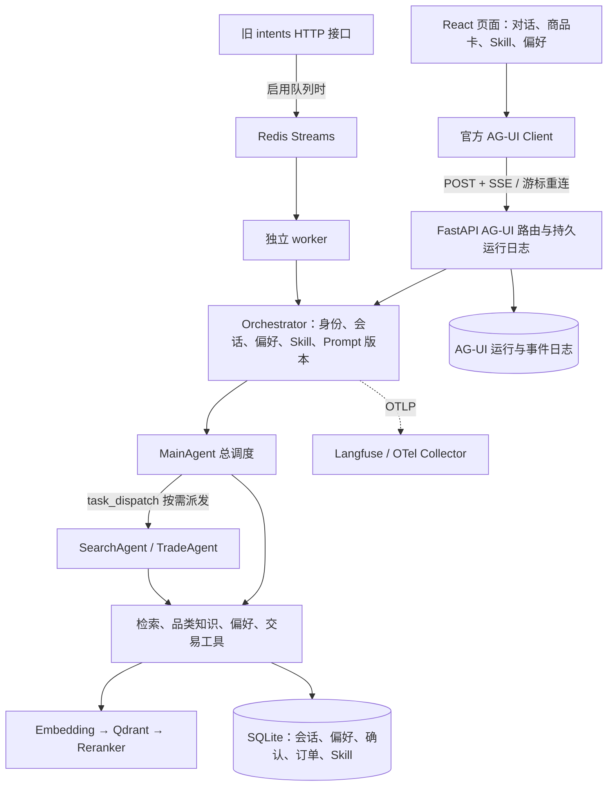

# Mall Work · 跨境电商选购 Agent

基于 **AgentScope 2.x + FastAPI + AG-UI + React** 的电商 Agent 工程。买家用自然语言描述需求，Agent 调用商品检索、品类知识和交易工具，页面实时渲染回答、商品卡和确认单；个人 Skill 与长期偏好可以直接在页面编写和保存。

项目对外品牌为 **Mall Work**；为兼容既有本地数据和会话，数据库文件、Redis 键、Qdrant 集合及协议中的部分 `globex` 内部标识会继续保留。

这是带持久化、运行恢复、观测和评测机制的课程实战工程。商品来自版本化样例目录，订单是本地业务账本，尚未接入真实电商供给、支付或物流。代码功能已交付，但正式检索与 Agent 质量门禁仍有 BLOCK，具体边界见[实施与验证总记录](docs/全计划实施与验证记录-2026-09-09.md)。

## 先选一种启动方式

| 方式 | 适合谁 | 需要什么 |
| --- | --- | --- |
| 让 Codex 帮忙启动 | 第一次接触工程、环境不熟悉 | 在 Codex 中打开本工程，准备可用模型凭据 |
| 本机双终端 | 开发、调试、修改前端 | Python 3.11–3.13、uv、Node.js 22、npm、模型服务 |
| Docker Compose | 验证 API、worker、Redis、Qdrant 与静态前端组合 | Docker Engine/Desktop、Compose v2、模型服务 |

### 让 Codex 帮忙跑起来

在 Codex 中打开 **`MallWork` 目录**（包含本 README、`pyproject.toml`、`frontend/`），可以直接说：

> 帮我把这个项目跑起来。先读 README 和现有配置，检查前置环境与端口；保留现有数据和 .env，不要覆盖。安装缺失依赖，启动前后端，验证健康检查和一次真实页面选购，最后告诉我访问地址。缺少模型凭据时告诉我需要配置哪些字段，不要打印密钥。

遇到问题可以继续追问，例如“页面一直转圈，请检查后端和模型日志”“刷新后看不到之前的记录，请核对买家身份和服务端数据”“解释这次请求经过了哪些 Agent 和工具”。提供错误信息即可；密钥填写在本机 `.env` 中，不需要贴到对话里。

### 本机启动：推荐开发路径

以下命令均从 `MallWork` 根目录执行。Python 版本范围由 `pyproject.toml` 约束；Node.js 22 与前端 Docker 构建保持一致。模型服务须支持 OpenAI 兼容协议、工具调用和流式输出，且当前账户能访问所选模型。

**1. 检查环境、安装依赖。**

```bash
python3 --version
uv --version
node --version
npm --version
uv sync --frozen
npm --prefix frontend ci
```

机器缺少 uv、Python 或 Node.js 时，可让 Codex 按当前系统补齐。工程复制或移动后不要继续依赖旧虚拟环境的绝对路径；重新同步依赖，并优先使用下文的 `python -m` 入口。

**2. 配置模型。已有 `.env` 时直接编辑，不覆盖。**

```bash
# 仅首次创建；存在时保持原文件
if [ ! -f .env ]; then cp .env.example .env; fi
```

在 `.env` 中填写以下字段。示例模型名对应默认网关，换供应商时也要换成该账户实际可用的模型。

```dotenv
LLM_BASE_URL=https://dashscope.aliyuncs.com/compatible-mode/v1
LLM_API_KEY=填写你的真实密钥
LLM_MODEL=qwen3-max
LLM_FALLBACK_MODEL=qwen-plus
EMBEDDING_MODEL=text-embedding-v4
```

只有 `LLM_API_KEY` 非空才允许启动；占位字符串不能用于真实对话。Embedding 默认复用 LLM 的网关和密钥，网关不支持 embedding 时需单独配置 `EMBEDDING_BASE_URL`、`EMBEDDING_API_KEY`。环境变量优先于根目录 `.env`。首次启动会加载商品目录、初始化持久库，并尝试建立商品和知识向量索引，可能需要一段时间和 embedding 调用费用。

最小本机模式使用 SQLite 和本地 Qdrant，无需 MySQL、Redis、Docker 或 Langfuse。首次体验建议不配置 `REDIS_URL`、`QDRANT_URL`；已有配置不要为了启动随意清空，应先确认原有数据与依赖。

**3. 终端一启动后端。**

```bash
uv run python -m uvicorn app.presentation.server:app --host 127.0.0.1 --port 8000 --workers 1
```

本地 Qdrant 对数据目录持有进程锁，先保持单进程，不要同时启动第二个后端或 worker 共用该向量目录。修改后端代码后重启此进程；`Ctrl+C` 可停止。

**4. 终端二启动前端。**

```bash
npm --prefix frontend run dev -- --host 127.0.0.1 --port 5173 --strictPort
```

打开 [http://127.0.0.1:5173](http://127.0.0.1:5173)。`--strictPort` 避免端口占用时自动换端口而不知情。前端同源代理 `/commerce` 和 `/health` 到 `http://127.0.0.1:8000`，通常不用配置 CORS 或 `VITE_API_BASE`。

已有本机页面若在 **5174**，继续使用原地址即可；5173 是项目默认端口。需要使用 5174 时，将命令中的端口改为 5174。**同一演示买家应固定协议、主机名和端口**：`localhost`、`127.0.0.1`、5173、5174 的浏览器存储不同，不会自动共享身份。

**5. 验证确实跑通。**

```bash
curl --fail http://127.0.0.1:8000/health
```

健康接口应返回 `status: ok`，数据库与启用的 Redis 不应报错；该检查不保证模型、精排服务可用，还要在页面发送一次“预算 300 元以内，找一个寄到中国的轻便背包”。检查流式回答、商品卡及运行记录。接口交互文档位于 [http://127.0.0.1:8000/docs](http://127.0.0.1:8000/docs)。

要检查生产构建而非开发热更新：

```bash
npm --prefix frontend run build
npm --prefix frontend run preview -- --host 127.0.0.1 --port 5174 --strictPort
```

先确认 5174 没有现有服务。Preview 使用 `dist/`，修改源码后需重新 build 并刷新页面。

## 页面能做什么

| 入口 | 使用方式与实际行为 |
| --- | --- |
| 我的选购 | 输入用途、预算、收货地；流式回答、商品卡、规格详情、2–3 件比较、心选收藏 |
| `/` 选择 Skill | 输入 `/` 选择方案后发送；服务端核对版本与内容哈希、读取正文，再交给 Agent 执行 |
| 我的 Skill | 编写名称、使用场景和 Markdown 步骤；保存、修改、删除均走服务端；仅当前买家可用，不自动发布为公共方案 |
| 长期偏好 | 添加、编辑、删除“喜欢／避免”；每轮执行前加载最新偏好，也可让 Agent 通过记住、修改、删除工具操作 |
| 对话历史 | 从服务端恢复会话；浏览器正文缓存用于加速，缺失或损坏时仍可按当前会话读取服务端内容 |
| 交易确认 | Agent 或页面生成确认单，买家明确批准后才执行本地订单与库存事务 |

例如：“记住我喜欢轻便的小众设计”“把喜欢黑色改成喜欢蓝色”“删除喜欢蓝色这条偏好”。只点保存成功的条目才是已持久化内容；未保存表单不是长期记忆。正在执行的一轮使用已加载上下文，修改在下一轮生效。个人 Skill 只指导现有工具使用，不允许买家上传脚本或扩大工具权限。

新安装的公共 Skill 目录可能为空：当前机器已发布的演示方案属于运行态数据，不随源码自动发布。可先创建自己的 Skill，公共方案管理见[Skill 与审核策略](docs/Skill与审核策略版本管理-2026-09-09.md)。

## 技术架构与请求路径



- **前端与传输**：React 18、TypeScript、Vite；官方 `@ag-ui/client/core 0.0.59` 对接后端 `ag-ui-protocol 0.1.22`。组件消费结构化商品和确认数据，不从模型 Markdown 猜测价格、库存或订单状态。
- **Agent 编排**：AgentScope 2.x，MainAgent 持有业务工具直接完成简单任务；需要并行、上下文隔离或长链时通过 `task_dispatch` 调用 SearchAgent/TradeAgent。子 Agent 与主 Agent 复用业务工具装配。
- **业务分层**：DDD 洋葱架构。领域层定义实体和端口，应用层负责用例、工具与编排，基础设施层实现数据库、模型和检索适配，FastAPI 位于最外侧；`composition.py` 统一装配 API 与 worker。
- **检索与知识**：版本化 JSONL 商品目录装入内存仓储；embedding → Qdrant → HTTP reranker，两级降级到向量排序或关键词。精确商品/SKU ID 可直接查权威目录；预算等硬约束由代码过滤。品类知识使用 Markdown + AgentScope KnowledgeBase。BM25/RRF Hybrid 已实现，默认关闭，尚未证明收益。
- **上下文与记忆**：偏好从持久库动态注入独立 hint；个人 Skill 常驻元数据，正文按需加载。工具完整证据与模型决策投影分离，支持证据回查、清理和压缩；预算不足时规则回复收口。Prompt 与工具合同版本绑定会话。
- **交易与可靠性**：确认、幂等操作、订单与库存由 SQLite 事务提交；会话 lease/fencing/CAS 防并发旧写。队列具备 pending 回收、死信与归档。网关并发、重试、熔断和 Harness 约束工具及模型执行。
- **观测与评测**：OTel/OTLP 关联 API、Agent、模型、工具，队列路径传播 Trace 上下文；Langfuse 可接收追踪与评分。独立 dev/release 数据、运行清单和门禁保留真实失败，不用单测通过代替效果达标。

**两条执行路径要分清**：当前网页的 AG-UI 请求在 API 进程直接执行，运行结果写持久日志；`QUEUE_ENABLED=1` 不会把这条路径自动转交 worker。Redis 队列用于旧 `/commerce/intents` 与异步任务入口，未启用队列时旧同步入口也在 API 进程执行。AG-UI 为保留商品等结构化事实，不使用只缓存最终文本的语义回复缓存。

## 数据保存在哪里

默认 `DATA_DIR` 为工程 `data/`；自定义目录建议用绝对路径。默认 SQLite 模式下：

| 数据 | 位置 / 归属 |
| --- | --- |
| Agent 会话状态、对话流水、长期偏好、交易确认、订单与库存 | `data/globex.db`，按买家/会话核验归属 |
| AG-UI run、消息、状态及可重放事件 | `data/ag_ui_runs.db` |
| 买家个人 Skill 与不可变修订 | `data/buyer_skills.db` |
| 公开 Skill、审核策略 / Prompt 版本 | `data/capabilities.db` / `data/prompts/registry.sqlite3` |
| 本地向量索引 | `data/qdrant/`；配置 Qdrant 服务端时由该服务保存 |
| 队列终态归档 | `data/queue_archive.db`；启用队列时使用 |
| 演示买家 ID、近期会话缓存、当前会话指针、心选收藏 | 同源浏览器 `localStorage`；收藏目前不跨设备同步 |
| 当前导航位置 | 当前标签页 `sessionStorage`；刷新保留 |

`DATABASE_URL=file` 只将会话、流水和偏好切到 JSON Store，交易仍保存到独立 `trade.db`，AG-UI 与个人 Skill 也仍用各自 SQLite 库。

普通刷新会恢复同一买家的数据；清除站点存储、更换域名/端口或换浏览器会失去默认演示身份，**不等于服务端数据已删除**。当前没有账号登录或跨设备身份找回，严格身份模式见下文。前后端都需保留原有数据与身份，不要通过删除 `data/`“修复”启动问题。备份可先停止写入进程再复制整个数据目录；运行中备份 SQLite 应使用一致性备份方法，不能只拷主文件忽略 WAL。

断开或刷新网页只断开订阅，服务端本轮继续执行；点击“停止”才明确取消。API 重启后尚未完成的运行会标为中断，保留已接收内容，不恢复模型内部执行栈。详见[持久运行恢复](docs/AG-UI持久运行与断线恢复-2026-09-09.md)、[刷新恢复修复](docs/刷新恢复修复-2026-09-09.md)。

## 可选配置与前置依赖

完整默认值以 [settings.py](app/infrastructure/settings.py) 为准，常用项见 [.env.example](.env.example)。

| 配置 | 作用与前提 |
| --- | --- |
| `EMBEDDING_BASE_URL/API_KEY/MODEL`、`EMBEDDING_DIM` | 网关需提供 embeddings；维度必须匹配模型及索引，默认 1024。换模型/维度需规划重建索引 |
| `RERANKER_BASE_URL`、`RERANKER_MODEL` | 可用 HTTP 精排服务；不配会走向量排序，主链正式门禁会因降级阻断 |
| `QDRANT_URL` | 为空使用本地嵌入式索引；API + worker 多进程应共用 Qdrant 服务端 |
| `REDIS_URL`、`QUEUE_ENABLED`、`WORKER_CONCURRENCY` | Redis 支持缓存、共享限流、队列；启用旧意图队列必须启动 worker。只使用 Redis 缓存时可设 `QUEUE_ENABLED=0` |
| `LANGFUSE_BASE_URL/PUBLIC_KEY/SECRET_KEY` | 三项齐全时自动装配现有 OTLP 导出；不配置不影响选购。地址填写纯 URL，例如 `https://cloud.langfuse.com` |
| `OTEL_EXPORTER_OTLP_ENDPOINT` 或 `OTEL_EXPORTER_OTLP_TRACES_ENDPOINT` | 已有 Collector 时使用；显式 OTLP 配置优先，认证头配置见专项文档 |
| `TAVILY_API_KEY` | 配置后注册 Web 搜索工具；不配不影响目录检索 |
| `TOKEN_BUDGET_TOTAL`、`REPLY_TOKEN_BUDGET` | 默认 0；启用后限制请求预算，需根据模型与任务实际测量 |
| `IDENTITY_MODE`、`IDENTITY_HMAC_SECRET` | 默认 `demo` 是客户端声明身份；`hmac` 校验签名身份，密钥至少 32 字节，不等同于完整登录/SSO |
| `PROMPT_PIN_VERSION` | 常规首次启动留空；只填写当前数据目录已导入的版本，不复制别人机器的版本 ID |
| `API_PROXY_TARGET` | Vite 后端代理目标，改后重启 Vite；例如后端改为 8001 时设为 `http://127.0.0.1:8001` |
| `VITE_API_BASE` | 浏览器跨域直连 API 才需要，还需配置后端 CORS；生产构建需重新 build |

所有 `VITE_*` 都可能进入浏览器构建产物，不能放模型、Langfuse 私钥或 HMAC 服务端密钥。严格身份的买家 token 配置见[身份与会话](docs/会话持久Fencing与身份模式.md)；Langfuse 设置及远端验收见[Trace 文档](docs/Langfuse与端到端Trace.md)。

## Docker Compose 启动

在根目录准备好 `.env` 与可用模型凭据，确认 5173、8000、6333、6379 未被其它服务占用：

```bash
docker compose --env-file .env -f docker/docker-compose.yaml config --quiet
docker compose --env-file .env -f docker/docker-compose.yaml up -d --build
docker compose --env-file .env -f docker/docker-compose.yaml ps
docker compose --env-file .env -f docker/docker-compose.yaml logs --tail 100 app worker
```

访问 [http://127.0.0.1:5173](http://127.0.0.1:5173)。包含 API、worker、Qdrant、Redis 和 Nginx 静态前端；Nginx 同源代理 API 并关闭 SSE 缓冲。`config --quiet` 只验证配置，避免将展开后的密钥打印出来。

Compose 用 `app-data`、`qdrant-data`、`redis-data` 命名卷，**不会自动读取本机 `data/` 中的买家记录或已发布方案**。不要直接沿用本机 `DATABASE_URL`、`DATA_DIR`、`PROMPT_PIN_VERSION`；容器路径与版本库需要对应。当前 Compose 的 embedding 默认复用 LLM 网关，若需独立 `EMBEDDING_BASE_URL/API_KEY`，还须在 `app` 和 `worker` 的 environment 中显式透传，仅写 `.env` 不会自动注入所有字段。

暂停并保留数据：

```bash
docker compose --env-file .env -f docker/docker-compose.yaml down
```

不要加 `-v`，该参数会删除命名卷。容器内不要用 `localhost` 访问宿主机模型服务，应使用部署环境可达的地址。

## 验证与排错

最近一次后端全量为 **931 passed、0 skipped**（个人 Skill / 偏好交付阶段），最近一次前端为 **96 passed、生产构建通过**（刷新修复阶段）。不同阶段分别留证，本次 README 整理不宣称重新运行全部业务测试。证据入口见[总记录](docs/全计划实施与验证记录-2026-09-09.md)。

```bash
# 基础代码回归；隔离本机 Langfuse 项目，避免把测试 Trace 导出到真实项目
LANGFUSE_BASE_URL='' LANGFUSE_PUBLIC_KEY='' LANGFUSE_SECRET_KEY='' uv run python -m pytest -q
npm --prefix frontend test
npm --prefix frontend run build
# 数据及正式评测集结构校验
uv run python -m scripts.eval.validate_datasets
```

真实 Redis 故障恢复测试需要本机 `redis-server`；不在 PATH 时设置 `GLOBEX_REDIS_SERVER_BIN=/绝对路径/redis-server`，否则相关测试会 skip，不能报告为完整无跳过验收。真实模型冒烟与正式评测会调用外部服务，命令、冻结集及门禁见[正式评测清单](docs/正式评测选集与证据清单.md)，不要把占位模型密钥用于效果验收。

| 现象 | 优先检查 |
| --- | --- |
| 缺少 `LLM_API_KEY` / 401 / 403 | 根目录 `.env`、环境变量覆盖、模型访问权限；不要输出完整密钥 |
| 429 或等待很久 | 网关配额、并发上限、请求间隔、备用模型权限；检查实际降级事件 |
| `/health` 200，但无商品或效果差 | 模型/embedding/reranker 日志和实际 `recall_strategy`；健康检查不验效果 |
| Qdrant 目录被锁 | 是否有第二个 API 或 worker 使用相同本地目录；多进程改用服务端 Qdrant |
| 旧 intents 请求一直等待 | Redis 是否可用、队列开关与 worker 是否匹配；网页 AG-UI 不依赖该 worker 消费 |
| 修改前端后还是旧页面 | 是否使用 preview 的旧 dist；重新 build 并刷新，核对实际端口 |
| 刷新或换地址后记录不见 | 先核对同源买家 ID、`DATA_DIR`/数据库及服务端历史；不要清空数据库 |
| Prompt/工具合同版本不匹配 | 使用既有注册流程导入当前合同并核对本机 pin；旧会话保留绑定，必要时开启新选购。不要删除版本库绕过校验 |

## 代码与施工文档导航

```text
app/domain/          领域模型与仓储、队列、会话端口
app/application/     Agent 编排、工具、用例、Prompt、Harness
app/infrastructure/  模型/检索/存储/缓存/队列/观测及版本库
app/presentation/    FastAPI、AG-UI、买家工作区、确认与身份接口
app/composition.py   依赖装配
app/worker.py        Redis 意图消费者
frontend/            React 页面、AG-UI 客户端与前端测试
knowledge/           品类知识及来源清单
data/catalog-v1.jsonl 版本化样例目录；其它 data 内容为运行态数据
scripts/             冒烟、评测、版本管理、身份 token 等 CLI
tests/、eval/        后端回归、冻结用例与验收证据
docker/              全栈 Compose 配置
```

主要 API 分组：`/commerce/ag-ui/run`、`/commerce/ag-ui/runs/*`、`/commerce/ag-ui/sessions/*`；`/commerce/skills` 与 `/commerce/my-skills`；`/commerce/preferences`；`/commerce/confirmations/*` 与 `/commerce/orders/*`；兼容入口 `/commerce/intents`、`/commerce/intents/async`、`/commerce/tasks/{id}` 和 WebSocket `/commerce/events`。以运行服务的 `/docs` 查看方法、参数和身份要求。

- [实施与验证总记录](docs/全计划实施与验证记录-2026-09-09.md)：当前交付、阶段证据和真实剩余问题，优先阅读。
- [设计与实施计划](docs/待实现设计与实施计划-2026-09-09.md)：12 个工作包的来源、实现方法与验收标准。
- [教程实现对齐清单](docs/教程实现对齐清单.md)、[设计演进记录](docs/设计演进记录.md)：教程映射、历史取舍。
- [买家自写 Skill 与长期记忆](docs/买家自写Skill与长期记忆-2026-09-09.md)、[刷新恢复修复](docs/刷新恢复修复-2026-09-09.md)：页面使用、持久化和实测结果。
- [交易确认与库存](docs/交易确认与库存验证-2026-09-09.md)、[会话与身份](docs/会话持久Fencing与身份模式.md)、[队列与重启](docs/队列安全归档与Redis重启验证-2026-09-09.md)：可靠性边界。
- [Prompt 版本与发布](docs/Prompt版本与人工发布.md)、[Skill 与审核策略](docs/Skill与审核策略版本管理-2026-09-09.md)、[指标与 Bad Case](docs/指标与BadCase闭环.md)：治理工具与审核流程。
- [正式评测与证据清单](docs/正式评测选集与证据清单.md)、[真实 release 结果](docs/正式release验证记录-2026-09-09.md)：商品、知识、Agent 的独立质量门禁。

当前目录规模为 500 SPU / 705 SKU，知识 45 篇；正式集含 150 条商品检索、50 条知识检索、100 条 Agent 用例。样例规模不代表真实全量电商供给。精排可用性与独立 release 达标、真实登录/跨设备身份、worker 的 Langfuse 远端验收，以及 Hybrid/A-B/策略收益仍需继续验证；已完成机制不会自动晋升为生产效果结论。
