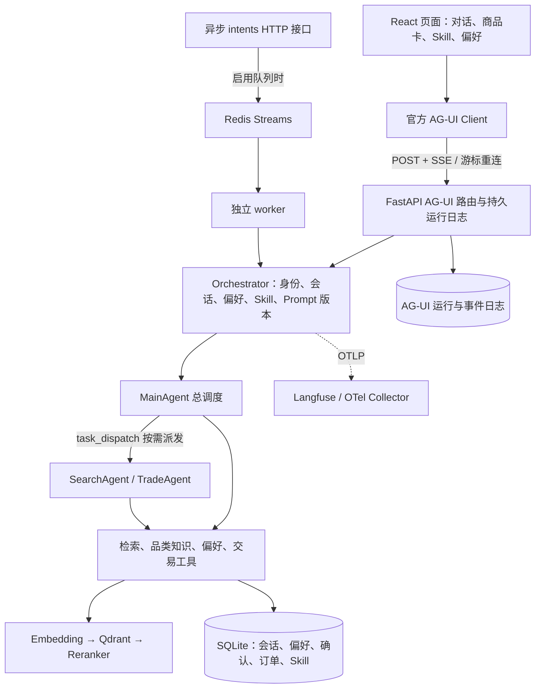

# Mall Work

Mall Work 是一个面向跨境电商选购场景的 Agent 工作台。买家可以用自然语言描述需求，系统负责检索商品、查询品类知识、处理偏好，并在页面上流式展示回答、商品卡和交易确认单。个人 Skill 和长期偏好也可以直接在页面中维护。

项目目前使用版本化样例商品目录和本地业务账本，尚未接入真实的商品供给、支付或物流系统。服务已经包含持久化、运行恢复、观测和质量验证能力；正式检索和 Agent 质量门禁仍有未通过项，需以实际评测结果为准。

## 产品方向

当前版本先解决买家的选购问题：理解自然语言需求，结合商品目录和品类知识给出建议，并在需要下单时保留确认环节。

后续会把同一套 Agent 能力扩展到商家侧，处理商品、运营和独立站接入。平台通过 Store Adapter 对接不同站点，Agent 负责理解目标、调用工具和执行受控流程，平台底座负责数据、权限、交易和审计。

## 启动方式

| 方式 | 适用场景 | 依赖 |
| --- | --- | --- |
| Codex 协助启动 | 第一次运行项目或环境不熟悉 | Codex、可用的模型凭据 |
| 本机双终端 | 开发和调试前后端 | Python 3.11 到 3.13、uv、Node.js 22、npm、模型服务 |
| Docker Compose | 一次启动 API、worker、Redis、Qdrant 和前端 | Docker Desktop、Compose v2、模型服务 |

### 使用 Codex 启动

在 Codex 中打开包含本 README、`pyproject.toml` 和 `frontend/` 的 `MallWork` 目录，然后说明：

> 帮我把这个项目跑起来。先读 README 和现有配置，检查前置环境与端口；保留现有数据和 .env，不要覆盖。安装缺失依赖，启动前后端，验证健康检查和一次真实页面选购，最后告诉我访问地址。缺少模型凭据时告诉我需要配置哪些字段，不要打印密钥。

如果页面一直转圈、刷新后看不到历史记录，或需要查看一轮请求经过了哪些 Agent 和工具，可以直接提供错误信息。密钥只放在本机 `.env` 中，不要粘贴到对话里。

### 本机开发

以下命令从项目根目录执行。Python 版本由 `pyproject.toml` 约束，前端 Docker 构建使用 Node.js 22。模型服务需要支持 OpenAI 兼容协议、工具调用和流式输出。

**1. 安装依赖**

```bash
python3 --version
uv --version
node --version
npm --version
uv sync --frozen
npm --prefix frontend ci
```

复制项目或更换机器后，请重新同步依赖，不要继续使用旧虚拟环境中的绝对路径。

**2. 配置模型**

已有 `.env` 时直接编辑，不要覆盖。首次创建可以执行：

```bash
touch .env
```

在 `.env` 中填写模型服务字段。下面的模型名只是默认示例，需要替换为当前账户可以访问的模型。

```dotenv
LLM_BASE_URL=https://dashscope.aliyuncs.com/compatible-mode/v1
LLM_API_KEY=填写你的真实密钥
LLM_MODEL=qwen3-max
LLM_FALLBACK_MODEL=qwen-plus
EMBEDDING_MODEL=text-embedding-v4
```

`LLM_API_KEY` 为空或仍是占位符时不能进行真实对话。Embedding 默认复用 LLM 网关和密钥；如果网关不提供 embedding，需要单独设置 `EMBEDDING_BASE_URL` 和 `EMBEDDING_API_KEY`。首次启动会加载商品目录、初始化持久库，并尝试建立商品和知识向量索引，这一步可能产生 embedding 调用费用。

最小本机模式使用 SQLite 和本地 Qdrant，不需要 MySQL、Redis、Docker 或 Langfuse。已有 Redis 或 Qdrant 配置时，不要为了启动而清空数据，先确认服务地址和数据归属。

**3. 启动后端**

```bash
uv run python -m uvicorn app.presentation.server:app --host 127.0.0.1 --port 8000 --workers 1
```

本地 Qdrant 会锁定数据目录，因此先只启动一个 API 进程，不要让第二个 API 或 worker 共用同一个本地目录。

**4. 启动前端**

```bash
npm --prefix frontend run dev -- --host 127.0.0.1 --port 5173 --strictPort
```

打开 [http://127.0.0.1:5173](http://127.0.0.1:5173)。前端会把 `/commerce` 和 `/health` 代理到 `http://127.0.0.1:8000`，通常不需要额外配置 CORS 或 `VITE_API_BASE`。

项目默认端口是 5173。如果使用 5174，请同时固定协议、主机名和端口。同一演示买家的浏览器存储按来源隔离，`localhost`、`127.0.0.1`、5173 和 5174 不会共享身份。

**5. 验证服务**

```bash
curl --fail http://127.0.0.1:8000/health
```

健康接口返回 `status: ok` 只说明服务、数据库和已启用的 Redis 可用，不代表模型或精排服务已经通过验证。启动后建议在页面发送一次“预算 300 元以内，找一个寄到中国的轻便背包”，检查流式回答、商品卡和运行记录。接口文档见 [http://127.0.0.1:8000/docs](http://127.0.0.1:8000/docs)。

要验证生产构建，可以执行：

```bash
npm --prefix frontend run build
npm --prefix frontend run preview -- --host 127.0.0.1 --port 5174 --strictPort
```

Preview 使用 `dist/`，修改源码后需要重新 build。

## 页面功能

| 入口 | 行为 |
| --- | --- |
| 我的选购 | 输入用途、预算和收货地，查看流式回答、商品卡、规格详情、商品比较和收藏 |
| `/` 选择 Skill | 输入 `/` 选择方案，服务端校验版本和内容哈希后交给 Agent 执行 |
| 我的 Skill | 编写名称、使用场景和 Markdown 步骤；内容只对当前买家可用 |
| 长期偏好 | 添加、修改和删除喜欢或避免的偏好；每轮执行前加载最新内容 |
| 对话历史 | 从服务端恢复会话，浏览器缓存只用于加速读取 |
| 交易确认 | 买家明确批准后，才执行本地订单和库存事务 |

例如可以说“记住我喜欢轻便的小众设计”“把喜欢黑色改成喜欢蓝色”或“删除喜欢蓝色这条偏好”。只有保存成功的条目才会进入长期记忆。个人 Skill 只能指导已有工具的使用，不能上传脚本或扩大工具权限。

## 请求路径



- 前端使用 React 18、TypeScript 和 Vite，通过 `@ag-ui/client/core 0.0.59` 对接后端 `ag-ui-protocol 0.1.22`。商品和确认数据由结构化事件提供，不从模型文本猜价格、库存或订单状态。
- Agent 编排使用 AgentScope 2.x。MainAgent 处理简单任务，需要并行、上下文隔离或长链时再通过 `task_dispatch` 调用 SearchAgent 或 TradeAgent。
- 代码采用 DDD 洋葱架构。领域层定义实体和端口，应用层负责用例、工具和编排，基础设施层实现数据库、模型和检索适配，FastAPI 位于最外层。
- 检索支持 BM25 和 Qdrant 向量召回，再用 RRF 融合并交给 HTTP reranker 精排。服务异常时会降级到可用的向量或关键词路径；预算等硬约束由代码过滤。设置 `HYBRID_RECALL_ENABLED=1` 开启混合召回，Compose 默认值为 0。
- 偏好从持久库动态加载，个人 Skill 只在需要时读取正文。工具证据和模型决策分开保存，支持回查、清理和压缩。
- 确认、幂等操作、订单和库存由 SQLite 事务提交。会话使用 lease、fencing 和 CAS 防止并发旧写，队列支持 pending 回收、死信和归档。
- OTel/OTLP 关联 API、Agent、模型和工具调用，Langfuse 可接收追踪和评分。质量验证区分开发数据和正式数据，不用单测通过代替效果结论。

网页的 AG-UI 请求在 API 进程中直接执行并写入运行日志。Redis 队列只服务 `/commerce/intents` 等异步入口，`QUEUE_ENABLED=1` 不会自动改变网页请求路径。

## 数据和持久化

默认 `DATA_DIR` 为项目下的 `data/`，自定义目录建议使用绝对路径。SQLite 模式下，数据库文件分别保存会话、偏好、确认、订单、Skill、AG-UI 运行日志和队列归档；本地向量索引位于 `data/qdrant/`，也可以改用 Qdrant 服务端。

演示买家 ID、近期会话缓存、当前会话指针和收藏保存在同源浏览器存储中。清除站点存储、更换域名或端口只会改变默认演示身份，不代表服务端数据已删除。项目当前没有账号登录或跨设备身份找回。

不要通过删除 `data/` 来处理启动问题。备份 SQLite 时应先停止写入，或使用一致性备份方法，不能只复制主文件而忽略 WAL。断开或刷新网页只会断开订阅，服务端本轮仍会继续执行；点击“停止”才会明确取消。

## 配置项

完整默认值以 [settings.py](app/infrastructure/settings.py) 为准。密钥和环境覆盖项只写入本机 `.env` 或进程环境，不提交仓库。

| 配置 | 作用 |
| --- | --- |
| `EMBEDDING_BASE_URL/API_KEY/MODEL`、`EMBEDDING_DIM` | embedding 网关和向量维度；更换模型或维度前需要规划重建索引 |
| `RERANKER_BASE_URL`、`RERANKER_MODEL`、`RERANKER_PROTOCOL` | HTTP 精排服务，支持通用协议和百炼 `dashscope` 协议 |
| `RERANKER_API_KEY` | 精排服务密钥，留空时复用 `LLM_API_KEY` |
| `QDRANT_URL` | 为空时使用本地嵌入式索引；多进程应使用 Qdrant 服务端 |
| `REDIS_URL`、`QUEUE_ENABLED`、`WORKER_CONCURRENCY` | Redis 缓存、限流和异步队列 |
| `LANGFUSE_BASE_URL/PUBLIC_KEY/SECRET_KEY` | 三项齐全时启用现有 OTLP 导出 |
| `TAVILY_API_KEY` | 配置后注册 Web 搜索工具 |
| `TOKEN_BUDGET_TOTAL`、`REPLY_TOKEN_BUDGET` | 限制请求和回复预算，默认不限制 |
| `IDENTITY_MODE`、`IDENTITY_HMAC_SECRET` | 客户端声明身份或 HMAC 身份校验 |
| `PROMPT_PIN_VERSION` | 将会话固定到已导入的 Prompt 版本 |
| `API_PROXY_TARGET`、`VITE_API_BASE` | 前端代理目标或跨域直连 API 的地址 |

所有 `VITE_*` 都可能进入浏览器构建产物，不能放模型密钥、Langfuse 私钥或 HMAC 服务端密钥。

## Docker Compose

在根目录准备好 `.env` 和模型凭据，确认 5173、8000、6333、6379 没有被其他服务占用：

```bash
docker compose --env-file .env -f docker/docker-compose.yaml config --quiet
docker compose --env-file .env -f docker/docker-compose.yaml up -d --build
docker compose --env-file .env -f docker/docker-compose.yaml ps
docker compose --env-file .env -f docker/docker-compose.yaml logs --tail 100 app worker
```

访问 [http://127.0.0.1:5173](http://127.0.0.1:5173)。Compose 会启动 API、worker、Qdrant、Redis 和 Nginx 静态前端，Nginx 同源代理 API 并关闭 SSE 缓冲。`config --quiet` 只验证配置，不会把展开后的密钥打印出来。

Compose 使用 `app-data`、`qdrant-data` 和 `redis-data` 命名卷，不会自动读取本机 `data/` 中的买家记录或已发布方案。容器内不要使用 `localhost` 访问宿主机模型服务，应使用部署环境可达的地址。

暂停服务但保留数据：

```bash
docker compose --env-file .env -f docker/docker-compose.yaml down
```

不要加 `-v`，否则会删除命名卷。

## 验证和排错

最近一次后端全量测试为 931 passed、0 skipped，前端为 96 passed 且生产构建通过。不同阶段分别留有证据；本次 README 整理不宣称重新运行全部业务测试。评测数据和运行产物位于本地 `eval/`，该目录不会提交到 Git。

```bash
LANGFUSE_BASE_URL='' LANGFUSE_PUBLIC_KEY='' LANGFUSE_SECRET_KEY='' uv run python -m pytest -q
npm --prefix frontend test
npm --prefix frontend run build
uv run python -m scripts.eval.validate_datasets
```

真实模型冒烟和正式评测会调用外部服务，不能用占位密钥代替效果验收。Redis 故障恢复测试需要本机可用的 `redis-server`；如果系统找不到该命令，相关测试会跳过。

| 现象 | 优先检查 |
| --- | --- |
| 缺少 `LLM_API_KEY`、401 或 403 | `.env`、环境变量覆盖、模型访问权限；不要输出完整密钥 |
| 429 或等待很久 | 网关配额、并发上限、请求间隔和备用模型权限 |
| `/health` 返回 200，但无商品或效果差 | 模型、embedding、reranker 日志和实际 `recall_strategy` |
| Qdrant 目录被锁 | 是否有第二个 API 或 worker 使用相同本地目录 |
| 异步 intents 请求一直等待 | Redis、队列开关和 worker 是否匹配 |
| 修改前端后还是旧页面 | 是否使用了旧的 preview dist，重新 build 后刷新 |
| 刷新或换地址后记录不见 | 同源买家 ID、`DATA_DIR`、数据库和服务端历史 |
| Prompt 或工具合同版本不匹配 | 导入当前合同并核对本机 pin，必要时开启新选购 |

## 目录说明

```text
app/domain/          领域模型、仓储、队列和会话端口
app/application/     Agent 编排、工具、用例、Prompt 和 Harness
app/infrastructure/  模型、检索、存储、缓存、队列和观测适配
app/presentation/    FastAPI、AG-UI、买家工作区、确认与身份接口
app/composition.py   依赖装配
app/worker.py        Redis 意图消费者
frontend/            React 页面、AG-UI 客户端和前端测试
knowledge/           品类知识及来源清单
data/catalog-v1.jsonl 版本化样例目录；其他 data 内容为运行态数据
scripts/             冒烟、评测、版本管理和身份 token CLI
tests/               后端回归测试
docker/              全栈 Compose 配置
```

主要 API 分组：`/commerce/ag-ui/run`、`/commerce/ag-ui/runs/*`、`/commerce/ag-ui/sessions/*`；`/commerce/skills`、`/commerce/my-skills`、`/commerce/preferences`、`/commerce/confirmations/*` 和 `/commerce/orders/*`；兼容入口 `/commerce/intents`、`/commerce/intents/async`、`/commerce/tasks/{id}` 和 WebSocket `/commerce/events`。以运行服务的 `/docs` 查看方法、参数和身份要求。

当前样例目录包含 500 个 SPU、705 个 SKU，知识库有 45 篇；正式集包含 150 条商品检索、50 条知识检索和 100 条 Agent 用例。样例规模不代表真实全量电商供给。精排可用性、独立 release 达标、真实登录、跨设备身份、worker 的 Langfuse 远端验收，以及 Hybrid、A/B 和策略收益仍需继续验证。
