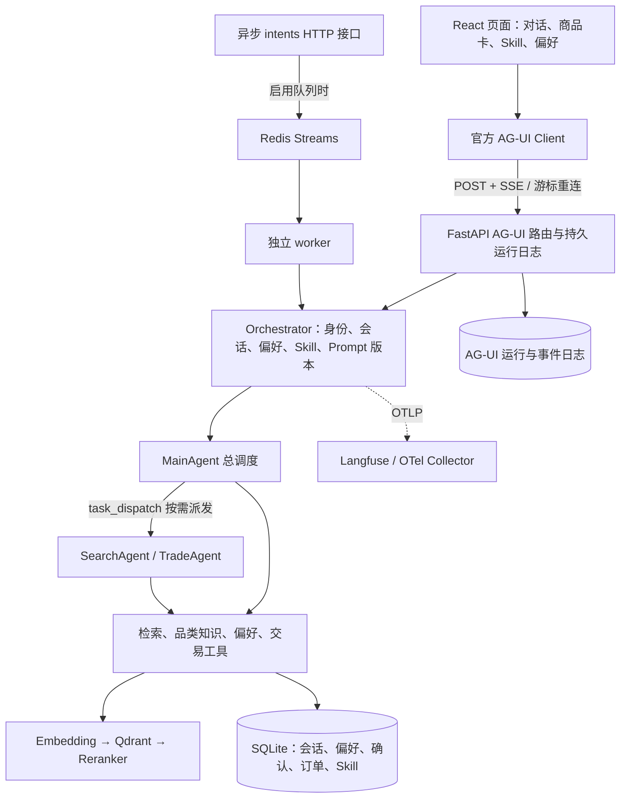

# Mall Work

Mall Work 是面向跨境电商选品和导购流程的 Agent 工作台。买家用自然语言描述预算、用途、收货地和偏好，系统检索商品与品类知识，给出可解释的建议，并在确认后创建本地订单。页面通过 AG-UI 接收流式回复、商品卡和确认状态，长期偏好与个人 Skill 可以在页面中维护。

当前版本是可运行的业务原型：商品目录和品类知识使用版本化样例数据，订单、库存和确认记录写入本地账本。项目没有接入真实商品供给、支付、物流、账号体系或跨设备身份服务。涉及价格、库存、税费和配送时，应以工具返回的数据为准。

## 产品范围

- 买家选品：按自然语言条件检索商品，查看规格、价格、库存和适配的收货地。
- 商品比较：在同一会话中保留商品卡，支持对比和收藏。
- 品类问答：从品类知识库检索参数判断、预算建议和注意事项。
- 偏好与 Skill：对喜欢或避免的偏好执行增删改查；个人 Skill 以 Markdown 步骤保存，只能指导已有工具。
- 交易确认：买家明确批准后才提交本地订单和库存事务，重复确认具有幂等保护。
- 运行恢复：服务端保存会话和 AG-UI 事件，网页刷新或断线后可以从游标继续读取。

商家运营、独立站接入和真实交易渠道属于后续扩展，不是当前版本的默认能力。

## 技术栈

| 层次 | 技术与用途 |
| --- | --- |
| Agent 编排 | AgentScope 2.x、Supervisor-Workers、MainAgent、SearchAgent、TradeAgent |
| API 与协议 | FastAPI、Pydantic、AG-UI Protocol、SSE、WebSocket |
| 前端 | React 18、TypeScript、Vite、官方 AG-UI Client |
| 检索 | BM25 关键词召回、Qdrant 向量召回、RRF 融合、HTTP Reranker |
| 模型 | OpenAI 兼容 LLM 网关、Embedding 网关、可选 DashScope Qwen 精排 |
| 数据与缓存 | SQLite、Qdrant、Redis Streams、结构化语义缓存 |
| 可靠性 | AgentLoop、LoopDetector、超时与幂等、lease/fencing/CAS |
| 观测与评测 | OpenTelemetry/OTLP、可选 Langfuse、离线数据集与 release benchmark |
| 工程环境 | Python 3.11 到 3.13、uv、Node.js 22、npm、Docker Compose |

## 系统结构

一次网页请求由 FastAPI 接收，经 Orchestrator 载入买家身份、会话、偏好、Skill 和 Prompt 版本，再交给 MainAgent。简单问题在主 Agent 内完成，需要独立上下文或并行检索时，通过 `task_dispatch` 调用 SearchAgent 或 TradeAgent。工具层负责商品、知识、偏好和交易操作，结果写入持久库并以结构化 AG-UI 事件返回前端。



前端使用 React 18、TypeScript 和 Vite，通过 `@ag-ui/client/core 0.0.59` 对接后端 `ag-ui-protocol 0.1.22`。商品和确认信息来自结构化事件，不从模型文本猜价格、库存或订单状态。

代码采用 DDD 洋葱架构。领域层定义实体、仓储和端口，应用层负责用例、工具和编排，基础设施层实现模型、检索、缓存、数据库、队列和观测适配，FastAPI 位于最外层。

## RAG 检索链路

1. 解析用户问题，提取预算、目的地、类别和其他硬约束。
2. 商品侧按配置选择 BM25、向量或混合召回。混合模式将两路排名用 RRF 合并。
3. 召回结果交给 HTTP Reranker 精排。精排不可用时，系统降级到仍可用的关键词或向量路径。
4. 代码层再次执行预算、库存和配送地过滤，避免模型绕过硬约束。
5. Agent 根据检索证据组织解释，商品卡和价格明细通过结构化事件发送给前端。

品类知识库使用同一套向量基础设施，但与商品集合分开管理。当前没有训练或微调 Embedding、双塔模型，使用的是外部 Embedding 服务。`HYBRID_RECALL_ENABLED=1` 才会启用商品混合召回，Compose 默认值为 0。

## 记忆、缓存与可靠性

会话分为近期消息、历史摘要和可管理的长期偏好。偏好在每轮执行前从持久库读取，支持新增、修改和删除；个人 Skill 只在需要时读取正文。页面结构化缓存可以保存回复、商品卡和必要事件，并按会话与上下文条件旁路，避免把过期商品信息直接复用。

AgentLoop 包含循环检测、工具调用超时、重复调用保护和错误降级。确认、订单和库存操作使用事务与幂等键；会话使用 lease、fencing 和 CAS，降低并发旧写覆盖新状态的风险。OTel/OTLP 会关联 API、Agent、模型和工具调用，工具级遥测只保留聚合信息，不记录原始买家参数。

## 启动方式

| 方式 | 适用场景 | 依赖 |
| --- | --- | --- |
| 本机双终端 | 开发和调试前后端 | Python 3.11 到 3.13、uv、Node.js 22、npm、模型服务 |
| Docker Compose | 一次启动 API、worker、Redis、Qdrant 和前端 | Docker Desktop、Compose v2、模型服务 |

### 本机开发

以下命令从项目根目录执行。Python 版本由 `pyproject.toml` 约束，模型服务需要支持 OpenAI 兼容协议、工具调用和流式输出。

**1. 安装依赖**

```bash
python3 --version
uv --version
node --version
npm --version
uv sync --frozen
npm --prefix frontend ci
```

**2. 配置模型**

已有 `.env` 时直接编辑，不要覆盖。首次创建可以执行：

```bash
touch .env
```

在 `.env` 中填写模型服务字段。模型名只是示例，需要替换为当前账户可访问的模型。

```dotenv
LLM_BASE_URL=https://dashscope.aliyuncs.com/compatible-mode/v1
LLM_API_KEY=填写你的真实密钥
LLM_MODEL=qwen3-max
LLM_FALLBACK_MODEL=qwen-plus
EMBEDDING_MODEL=text-embedding-v4
```

`LLM_API_KEY` 为空或仍是占位符时不能进行真实对话。Embedding 默认复用 LLM 网关和密钥；如果网关不提供 embedding，需要单独设置 `EMBEDDING_BASE_URL` 和 `EMBEDDING_API_KEY`。首次启动会加载商品目录、初始化持久库，并尝试建立商品和知识向量索引，这一步可能产生 embedding 调用费用。

**3. 启动后端**

```bash
uv run python -m uvicorn app.presentation.server:app --host 127.0.0.1 --port 8000 --workers 1
```

本地 Qdrant 会锁定数据目录，因此先只启动一个 API 进程，不要让第二个 API 或 worker 共用同一个本地目录。

**4. 启动前端**

```bash
npm --prefix frontend run dev -- --host 127.0.0.1 --port 5173 --strictPort
```

打开 [http://127.0.0.1:5173](http://127.0.0.1:5173)。前端会把 `/commerce` 和 `/health` 代理到 `http://127.0.0.1:8000`。

**5. 验证服务**

```bash
curl --fail http://127.0.0.1:8000/health
```

健康接口返回 `status: ok` 只说明服务、数据库和已启用的 Redis 可用，不代表模型或精排服务已经通过验证。启动后可以在页面发送一次“预算 300 元以内，找一个寄到中国的轻便背包”，检查流式回答、商品卡和运行记录。接口文档见 [http://127.0.0.1:8000/docs](http://127.0.0.1:8000/docs)。

要验证生产构建，可以执行：

```bash
npm --prefix frontend run build
npm --prefix frontend run preview -- --host 127.0.0.1 --port 5174 --strictPort
```

Preview 使用 `dist/`，修改源码后需要重新 build。

### Docker Compose

在根目录准备好 `.env` 和模型凭据，确认 5173、8000、6333、6379 没有被其他服务占用：

```bash
docker compose --env-file .env -f docker/docker-compose.yaml config --quiet
docker compose --env-file .env -f docker/docker-compose.yaml up -d --build
docker compose --env-file .env -f docker/docker-compose.yaml ps
docker compose --env-file .env -f docker/docker-compose.yaml logs --tail 100 app worker
```

访问 [http://127.0.0.1:5173](http://127.0.0.1:5173)。Compose 会启动 API、worker、Qdrant、Redis 和 Nginx 静态前端，Nginx 同源代理 API 并关闭 SSE 缓冲。`config --quiet` 只验证配置，不会把展开后的密钥打印出来。

Compose 使用 `app-data`、`qdrant-data` 和 `redis-data` 命名卷。暂停服务但保留数据：

```bash
docker compose --env-file .env -f docker/docker-compose.yaml down
```

不要加 `-v`，否则会删除命名卷。容器内不要用 `localhost` 访问宿主机模型服务，应使用部署环境可达的地址。

## 配置项

完整默认值以 [settings.py](app/infrastructure/settings.py) 为准。密钥和环境覆盖项只写入本机 `.env` 或进程环境，不提交仓库。

| 配置 | 作用 |
| --- | --- |
| `EMBEDDING_BASE_URL/API_KEY/MODEL`、`EMBEDDING_DIM` | embedding 网关和向量维度；更换模型或维度前需要规划重建索引 |
| `RERANKER_BASE_URL`、`RERANKER_MODEL`、`RERANKER_PROTOCOL` | HTTP 精排服务，支持通用协议和百炼 `dashscope` 协议 |
| `RERANKER_API_KEY` | 精排服务密钥，留空时复用 `LLM_API_KEY` |
| `QDRANT_URL` | 为空时使用本地嵌入式索引；多进程应使用 Qdrant 服务端 |
| `REDIS_URL`、`QUEUE_ENABLED`、`WORKER_CONCURRENCY` | Redis 缓存、限流和异步队列 |
| `AGUI_STRUCTURED_CACHE_ENABLED`、`AGUI_CACHE_TTL_SECONDS` | 页面结构化语义缓存开关与 TTL |
| `LANGFUSE_BASE_URL/PUBLIC_KEY/SECRET_KEY` | 三项齐全时启用现有 OTLP 导出 |
| `TAVILY_API_KEY` | 配置后注册 Web 搜索工具 |
| `TOKEN_BUDGET_TOTAL`、`REPLY_TOKEN_BUDGET` | 限制请求和回复预算，默认不限制 |
| `IDENTITY_MODE`、`IDENTITY_HMAC_SECRET` | 客户端声明身份或 HMAC 身份校验 |
| `PROMPT_PIN_VERSION` | 将会话固定到已导入的 Prompt 版本 |
| `API_PROXY_TARGET`、`VITE_API_BASE` | 前端代理目标或跨域直连 API 的地址 |

所有 `VITE_*` 都可能进入浏览器构建产物，不能放模型密钥、Langfuse 私钥或 HMAC 服务端密钥。

## 数据、测试与评测

默认 `DATA_DIR` 为项目下的 `data/`。SQLite 保存会话、偏好、确认、订单、Skill、AG-UI 运行日志和队列归档；本地向量索引位于 `data/qdrant/`，也可以改用 Qdrant 服务端。浏览器只保存演示买家 ID、会话指针和读取加速缓存，清除站点存储不会删除服务端数据。

评测数据和运行产物位于本地 `eval/`，该目录不会提交到 Git。开发阶段先做离线校验，缓存统计、工具遥测和串行与并行延迟分析都可以使用单元测试、Mock Worker 或已保存事件回放，不会自动调用模型。

```bash
LANGFUSE_BASE_URL='' LANGFUSE_PUBLIC_KEY='' LANGFUSE_SECRET_KEY='' uv run python -m pytest -q
npm --prefix frontend test
npm --prefix frontend run build
uv run python -m scripts.eval.validate_datasets
```

延迟分析脚本只读取 JSONL 样本：

```bash
uv run python -m scripts.eval.latency_benchmark \
  --serial path/to/serial.jsonl \
  --parallel path/to/parallel.jsonl \
  --output path/to/latency-report.json
```

正式 release benchmark 会调用外部模型，应固定同一批用例、模型和 Prompt，并关闭语义缓存与页面结构化缓存。最终评测前可先运行只读冻结检查：

```bash
uv run python -m scripts.eval.release_preflight --strict
```

它会核对商品、知识库和 Agent release split 的数量、源码和配置状态，不会打印密钥，也不会发起模型请求。真实模型冒烟和效果评测不能用占位密钥代替。

页面结构化缓存有独立 benchmark。默认命令只生成并校验 20 个主题、100 条 eligible 请求的数据，不访问服务；只有显式加 `--execute` 才会产生真实模型调用。每个主题首条回源，后四条检查缓存命中、回复与商品卡一致性。命中率按 80 条重复变体统计，首条冷启动 miss 不计入分母。报告保存在本地 `eval/cache/`，不会提交到 Git。

```bash
uv run python -m scripts.eval.cache_benchmark
uv run python -m scripts.eval.cache_benchmark --execute
```

## 目录说明

```text
app/domain/          领域模型、仓储、队列和会话端口
app/application/     Agent 编排、工具、用例、Prompt 和 Harness
app/infrastructure/  模型、检索、存储、缓存、队列和观测适配
app/presentation/    FastAPI、AG-UI、买家工作区、确认与身份接口
app/composition.py   依赖装配
app/worker.py        Redis 意图消费者
frontend/            React 页面、AG-UI 客户端和前端测试
knowledge/           品类知识及来源清单
data/catalog-v1.jsonl  版本化样例目录；其他 data 内容为运行态数据
scripts/             冒烟、评测、版本管理和身份 token CLI
tests/               后端回归测试
docker/              全栈 Compose 配置
```

主要 API 分组：`/commerce/ag-ui/run`、`/commerce/ag-ui/runs/*`、`/commerce/ag-ui/sessions/*`；`/commerce/skills`、`/commerce/my-skills`、`/commerce/preferences`、`/commerce/confirmations/*` 和 `/commerce/orders/*`；兼容入口 `/commerce/intents`、`/commerce/intents/async`、`/commerce/tasks/{id}` 和 WebSocket `/commerce/events`。以运行服务的 `/docs` 查看方法、参数和身份要求。

样例目录包含 500 个 SPU、705 个 SKU，知识库有 45 篇；正式集包含 150 条商品检索、50 条知识检索和 100 条 Agent 用例。样例规模不代表真实全量电商供给。精排可用性、独立 release 达标、真实登录、跨设备身份、worker 的远端观测验收，以及不同检索策略的收益仍需按最新评测报告确认。
