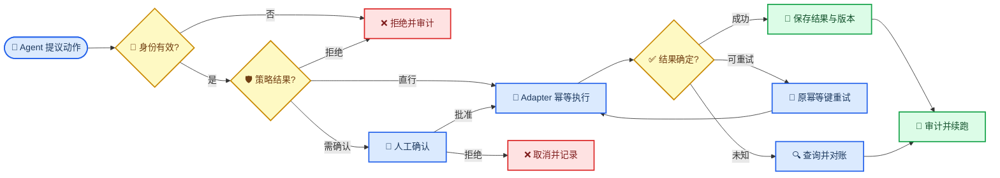

# MallWork 中心控制面与站点接入架构

_目标架构与边界说明；当前实现状态以文中状态表为准。_

---

## 📋 架构决策

MallWork 采用“中心化控制面 + 站点侧轻量 Adapter/Connector”。控制面负责身份、Agent、工作流、策略、审批、审计、评测与部署编排，站点 Connector 只负责把通用契约映射为目标平台 API。

### 决策原因

| 关注点 | 选择带来的结果 |
| --- | --- |
| 一致治理 | 身份、审批、审计、模型和能力版本集中管理 |
| 多站点扩展 | 核心用例依赖通用能力，不依赖 ZMall DTO 或 URL |
| 故障隔离 | 单站点 Connector 故障不会改变其他租户和站点策略 |
| 可验证性 | 所有 Adapter 运行同一套契约测试和故障语义 |
| 演进成本 | 当前 Compose 可继续运行，能力按阶段增量加入 |

未选择“每个站点部署完整 Agent 平台”，因为它会复制调度、模型、策略、审计和升级面；也未选择“控制面直连每个站点数据库”，因为这会破坏业务约束、凭据隔离和可回滚性。

## 🌐 系统上下文

```mermaid
flowchart LR
    accTitle: MallWork Control Plane Context
    accDescr: MallWork centralizes goals, agents, policy, approvals, audit, and evaluation while lightweight Store Adapters connect governed operations to multiple independent commerce sites.

    consumers([👤 消费者]) --> web_app[🌐 MallWork Web]
    merchants([👤 商家]) --> web_app

    subgraph control_plane ["🧠 MallWork 控制面"]
        identity[🔐 身份与租户]
        digital_boss[🧠 数字老板]
        employees[🤖 数字员工]
        workflow[⚙️ 工作流与调度]
        approval[🛡️ 策略与审批]
        registry[🏷️ 能力与 Adapter 注册]
        observability[📊 审计与评测]
    end

    web_app --> identity
    identity --> digital_boss
    digital_boss --> workflow
    workflow --> employees
    employees --> approval
    approval --> registry
    approval --> observability

    registry --> zmall_adapter[🔌 ZMall Adapter]
    registry --> standard_adapter[🔌 标准站点 Adapter]
    registry --> future_adapter[🔌 后续平台 Adapter]
    zmall_adapter --> zmall_store[(💾 ZMall 店铺)]
    standard_adapter --> owned_store[(💾 独立站)]
    future_adapter --> platform_store[(💾 第三方平台)]

    classDef actor fill:#ede9fe,stroke:#7c3aed,stroke-width:2px,color:#3b0764
    classDef core fill:#dbeafe,stroke:#2563eb,stroke-width:2px,color:#1e3a5f
    classDef connector fill:#fef9c3,stroke:#ca8a04,stroke-width:2px,color:#713f12
    classDef store fill:#dcfce7,stroke:#16a34a,stroke-width:2px,color:#14532d

    class consumers,merchants actor
    class web_app,identity,digital_boss,employees,workflow,approval,registry,observability core
    class zmall_adapter,standard_adapter,future_adapter connector
    class zmall_store,owned_store,platform_store store
```

## ⚙️ 控制面模块

| 模块 | 责任 | 当前状态 |
| --- | --- | --- |
| Identity/Tenant Context | tenant、store、actor、角色和权限域 | 规划中；现有 `buyer_id` 隔离可作为参考底座 |
| Agent Runtime | Main、Search、Trade 和专业数字员工编排 | 已具备底座；商家数字员工规划中 |
| Autonomy Runtime | 持久任务、定时/事件触发、工作流、恢复 | 规划中；现有 Redis 意图队列不是调度器 |
| Policy/Approval | 风险分级、策略判断、人工确认、拒绝 | 已具备底座；现覆盖消费者交易，通用操作待扩展 |
| Adapter Registry | 发现站点能力、版本和健康状态 | 规划中 |
| Event Ingestion | 接收、验证、去重和分发站点事件 | 已具备事件底座；站点事件协议规划中 |
| Observability/Evaluation | Trace、指标、Bad Case、审计和发布门禁 | 已具备底座；商家动作审计规划中 |
| Secrets Boundary | 凭据存取、轮换、遮蔽和最小权限 | 规划中；不得把秘密放入 Prompt 或事件 |
| Deployment Control | 构建、预览、审批、发布、健康与回滚 | 规划中 |

“已具备底座”只表示新工程存在可复用基础设施，不表示目标业务能力已交付。

## 🔌 Store Adapter 边界

### 控制面负责

- 生成并验证 tenant/store/actor 执行上下文
- 根据能力、版本、健康和策略选择 Adapter
- 计算业务意图、风险级别、审批与幂等信息
- 管理任务、重试、工作流、审计和评测
- 保存通用领域状态和 Adapter 操作句柄

### Connector 负责

- 把通用请求映射为站点 API、DTO、认证和分页方式
- 处理站点 token 刷新、签名、速率限制和传输级重试
- 把站点状态、错误和异步任务转换为统一契约
- 验证 webhook 签名并产生标准事件信封
- 报告能力版本与健康，不自行改变控制面策略

### 禁止越界

- Agent 不得调用站点数据库或内部表
- 通用领域层不得引用 ZMall 路径、状态码或 DTO 字段
- Connector 不得自行批准高风险操作或扩大 actor 权限
- 传输重试不得重复不可幂等的写操作
- Connector 不得把凭据、密码或完整 token 写入日志、错误或模型上下文

完整协议见 [Store Adapter v1](../contracts/store-adapter-v1.md)。

## 🔄 命令、异步任务与事件

### 同步命令

只用于能够在调用超时内确定完成或失败的读取、小范围验证和快速写入。控制面生成 `request_id` 与 `correlation_id`；写命令同时携带 `idempotency_key` 和必要的 `expected_version`。

### 异步操作

图片/视频生成、批量上货、广告发布、站点构建和部署返回统一操作句柄。控制面轮询或消费事件，状态限定为 `accepted`、`running`、`succeeded`、`failed`、`canceled` 或 `expired`。重试复用原幂等键，不创建平行副作用。

### 站点事件

事件使用稳定 `event_id` 去重，携带 `tenant_id`、`store_id`、事件类型、资源引用、发生时间、接收时间、契约版本和关联 ID。接收端先验证签名和重放窗口，再持久化去重记录，最后异步分发；HTTP acknowledgement 不等于业务工作流已完成。

## 🔐 信任与隔离模型

### 身份链

外部身份经 API 边界验证后转换为内部 actor；任务快照保存 actor 身份和权限版本，但执行时仍重新检查当前授权。数字老板只能委派自己权限范围内的任务，数字员工不能通过下游调用扩大权限。

### 租户与店铺隔离

所有核心实体、任务、操作、事件、审计和 Adapter 凭据都以 `tenant_id` 和 `store_id` 分区。数据库查询必须显式带范围，缓存键、队列主题、向量过滤和对象存储路径也使用相同范围。缺少范围时默认拒绝。

### 凭据所有权

控制面保存凭据引用而不是把明文凭据放入任务。Connector 在执行边界按引用获取短期凭据；日志仅记录凭据版本/指纹。轮换后新任务使用新版本，进行中的幂等操作按平台语义完成或对账。

### 审计完整性

审计记录至少包含 actor、tenant/store、目标能力、风险、审批、参数摘要、资源前后版本、幂等键哈希、结果、耗时、重试与关联链路。审计内容需遮蔽密码、token、个人敏感字段和模型隐藏上下文。

## ⚠️ 故障与恢复

| 故障 | 控制面行为 | 恢复条件 |
| --- | --- | --- |
| Adapter 不可用 | 熔断、暂停站点写任务、保留工作流状态 | 健康恢复并通过探测 |
| 写入超时/结果未知 | 不换幂等键重发；先查询或对账 | 确认已成功或安全重试 |
| 部分批量成功 | 保存逐项结果，失败项独立重试 | 每项状态最终确定 |
| 库存数据陈旧 | 标记快照时间，禁止基于过期值自动写入 | 获得新快照并重新评估 |
| 429 限流 | 尊重 `retry_after`，指数退避并降低并发 | 限流窗口结束 |
| 重复事件 | 按 `event_id` 返回已接收，不重复触发 | 去重记录在重放窗口内 |
| 长运行任务中断 | 从持久检查点续跑或进入人工处理 | 租约回收且状态可证明 |
| 工作流步骤失败 | 达到重试上限后标记 blocked | 人工修正后从失败步骤续跑 |
| 部署健康失败 | 停止放量并回滚到不可变上一版本 | 回滚健康检查通过 |

## 📦 部署拓扑

### 当前阶段

当前单机 Docker Compose 继续承载 `frontend`、`app`、`worker`、Redis 和 Qdrant，SQLite 与现有数据卷保持不变。本设计阶段不修改 Compose、不重建镜像、不重启容器。Phase 1 的唯一新产物是 `docs/` 文档。

### 目标阶段

控制面可独立扩展 API 与 worker；共享关系数据、队列/缓存、向量库、对象存储和密钥服务按环境托管。每个站点使用进程内 Adapter 或独立 Connector 服务，选择取决于网络边界与凭据隔离要求，但两者必须实现同一契约。独立站部署使用不可变版本、预览、审批、健康验证和回滚，不与控制面的应用发布混为一次操作。

## 📍 演进边界

1. 先建立 tenant/store/actor 模型和默认拒绝的授权边界
2. 再实现 Store Adapter 领域端口、注册表和契约测试
3. 用 ZMall 完成第一套映射，但禁止通用协议出现 ZMall 专属字段
4. 在身份和 Adapter 稳定后加入持久调度、工作流和通用审批
5. 在运行治理成熟后开放商家写操作、创意发布和站点部署
6. 通过第二平台 Adapter 后才把 v1 视为可移植生态协议

需求到阶段的完整追踪见 [MallWork 电商生态系统需求基线](../requirements/MallWork电商生态系统需求基线.md)。
