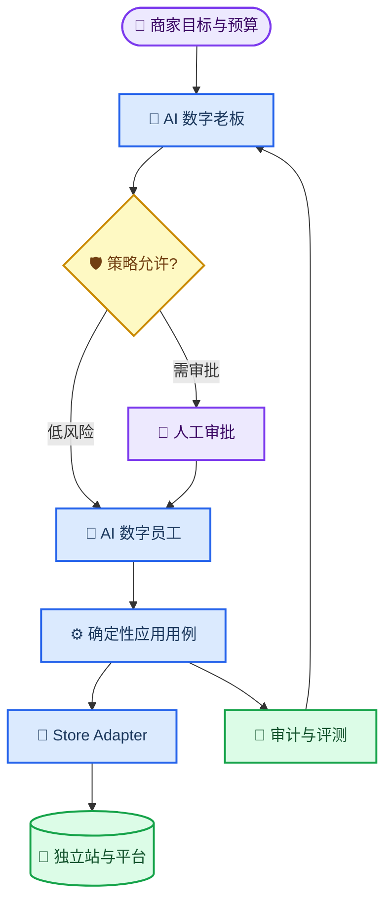

# MallWork 电商生态系统蓝图

_MallWork 产品北极星文档；描述目标形态，不代表所有能力已经实现。_

---

## 🎯 产品定位

MallWork 是面向消费者与商家的电商智能协作平台。产品以已经运行的 React、FastAPI、AgentScope、Redis、SQLite、Qdrant 和 Docker Compose 系统为唯一运行时，通过一个中心控制面管理“AI 数字员工”和“AI 数字老板”，再通过标准 Store Adapter 接入多个独立站或第三方平台。

产品目标不是制造一个拥有无限权限的通用 Agent，而是建立一组职责明确、权限受控、结果可验证的专业 Agent，让商家可以把目标转换为持续运营，让消费者可以在可解释、可确认的流程中完成选购和交易。

### 目标用户

| 用户 | 核心任务 | MallWork 价值 |
| --- | --- | --- |
| 消费者 | 找商品、比较、搭配、咨询、下单与售后 | 个性化建议、理由透明、交易前确认 |
| 店员 | 处理商品、库存、内容与客服任务 | 标准工作流、异常聚合、执行留痕 |
| 商家管理员 | 设定目标、预算、策略和审批边界 | 跨职能协同、风险控制、结果复盘 |
| 平台管理员 | 管理租户、站点、能力和发布 | 隔离、治理、可观测和契约一致性 |

### 明确非目标

- 不把旧 Pi CLI/TUI、Node.js Agent 循环或扩展运行时并入新产品
- 不允许 Agent 绕过应用用例或 Store Adapter 直接写业务数据库
- 不在第一阶段宣称多租户、商家工作台、持久调度或自动建站已经完成
- 不用一个 ZMall 专属接口冒充通用生态协议
- 不用自主运行替代人工责任；高风险副作用必须符合策略、审批和审计要求

## 👥 双层运营模型

### AI 数字员工

数字员工是受角色、租户、店铺、能力、预算和风险策略约束的专业执行单元。首批组合如下：

| 数字员工 | 主要职责 | 典型输出 | 写操作边界 |
| --- | --- | --- | --- |
| Consumer Concierge | 推荐、穿搭、客服、交易协助 | 商品候选、搭配方案、客服答复 | 下单、取消、售后须确认 |
| Product Researcher | 趋势、竞品、选品 | 研究报告、候选清单、证据摘要 | 默认只读，付费数据源须授权 |
| Inventory Operator | 预警、补货、安全库存 | 库存告警、补货建议 | 库存调整须策略或审批 |
| Pricing Operator | 竞价、毛利、促销价格 | 建议价、影响分析 | 实际改价为高风险动作 |
| SEO/Content Operator | 关键词、标题、描述、内容 | 可复核草案、效果报告 | 发布或覆盖内容须审批策略 |
| Site Builder | 生成、测试、预览独立站 | 不可变构建物、预览地址 | 生产部署与回滚须审批 |

### AI 数字老板

数字老板是监督编排层，而不是数据库超级用户。它负责：

- 把商家的目标、预算和 KPI 拆分为可执行工作流
- 为任务选择数字员工、模型策略和 Store Adapter 能力
- 根据风险级别决定直行、人工审批或拒绝
- 处理异常升级、重试上限、阻塞工作流和人工接管
- 根据审计、效果指标和 Bad Case 复盘策略

数字老板不直接修改商品、价格、库存、订单、广告或部署状态。所有副作用必须进入确定性应用用例，并通过 Store Adapter 的幂等、版本与审计协议执行。

## 🔄 价值闭环

### 消费者闭环

1. Consumer Concierge 理解需求、预算、场景与偏好
2. Product Researcher 和检索能力提供候选与依据
3. 消费者比较、调整或请求穿搭与替代品
4. 系统在下单、取消或售后前展示影响并请求确认
5. 交易结果和明确偏好进入受身份隔离的会话与长期记忆
6. 评测系统追踪推荐质量、确认转化和失败原因

### 商家闭环

1. 商家管理员设定目标、预算、KPI 和授权范围
2. 数字老板拆解为研究、库存、价格、内容和营销工作流
3. 数字员工读取站点数据、产出建议并提交受控动作
4. 策略层自动放行低风险动作，并升级高风险动作供人工确认
5. Store Adapter 执行、回传结果并产生审计事件
6. 数字老板根据转化、毛利、库存和失败数据复盘下一周期

## 🔐 权限与安全边界

- 每个请求和任务最终携带 `tenant_id`、`store_id`、`actor_id`、角色/权限域及关联 ID
- 跨租户和跨店铺访问默认拒绝，不能仅靠 Prompt 提醒实现隔离
- 凭据由平台密钥边界保管，模型输入、日志和审计摘要不得包含 token 或密码
- 价格、库存、上下架、订单、售后、广告发布、推流和生产部署必须具备幂等键
- 高风险动作需要人工确认或预先批准的窄范围策略；白名单只适用于边界明确的低风险动作
- 每次动作都记录发起者、依据、参数摘要、前后状态、结果、耗时和关联链路
- 失败时优先停止副作用并提供重试、续跑或补偿信息，不能依赖模型“猜测已成功”

## 📊 成功指标

| 维度 | 指标 | 首要判定 |
| --- | --- | --- |
| 消费者价值 | 推荐采纳率、比较后转化率、确认完成率 | 建议可解释且不诱导越权交易 |
| 商家效率 | 自动生成任务占比、人工处理时长、工作流完成率 | 节省时间且异常可接管 |
| 经营结果 | 转化、毛利、库存周转、缺货率 | 不以牺牲毛利或安全为代价 |
| 自主性 | 定时/事件任务成功率、人工升级率、恢复率 | 可持续运行且能安全停下 |
| 可靠性 | Adapter 成功率、重复写入率、恢复时间 | 重复副作用为零目标 |
| 治理 | 越权拦截率、审计完整率、评测门禁通过率 | 所有高风险动作可追溯 |

具体阈值在对应能力进入实现阶段时通过基线数据确定；本蓝图不虚构尚无数据支持的百分比目标。

## 📍 产品推进顺序

1. 保护 Pi 遗留成果并完成需求映射
2. 建立 tenant/store 身份与授权基础
3. 实现 Store Adapter v1 运行时和契约测试
4. 以 ZMall 验证消费者能力与首个站点接入
5. 建立持久任务、工作流、审批和数字老板运行时
6. 交付商家运营、监控和创意数字员工
7. 交付标准站点、接入 SDK 与受控部署流水线
8. 用第二个平台 Adapter 证明协议可移植性
9. 在远端备份和功能验收后，单独决定旧仓库归档或删除

详细依赖、退出条件和回滚边界见[分阶段实施路线图](../roadmap/MallWork分阶段实施路线图.md)。Store Adapter 的技术约束见[协议草案](../contracts/store-adapter-v1.md)。

## 📚 状态口径

本系列迁移文档统一使用四种产品状态：

| 状态 | 含义 |
| --- | --- |
| 已实现 | 新 MallWork 中已有可定位代码与验证证据 |
| 已具备底座 | 基础设施存在，但目标业务能力尚不完整 |
| 规划中 | 已进入蓝图或路线图，尚未交付 |
| 淘汰 | 旧运行方式不进入新产品，仅保留历史证据 |

旧 Pi 仓库中的代码存在不等于新 MallWork 已实现。逐项证据见[Pi 遗留资产迁移清单](../migration/pi遗留资产迁移清单.md)和[OpenSpec 需求映射](../migration/pi-openspec需求映射.md)。
