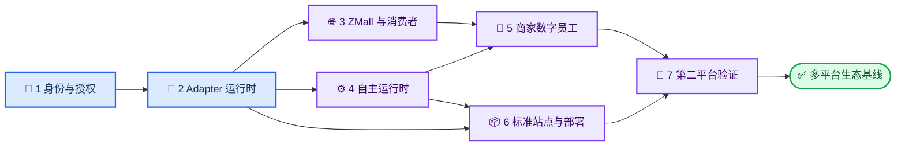

# MallWork 分阶段实施路线图

_从身份与站点基础到多平台生态验证的交付顺序；每个阶段均需单独设计、计划和验收证据。_

---

## 🔗 依赖与关键路径

关键路径是 Phase 1 → 2 → 4 → 5/6 → 7。Phase 3 可以在 Adapter 运行时稳定后与 Phase 4 的部分只读工作并行，但任何跨店铺自主写入都必须等待 Phase 1、2、4 同时通过。

## 🔐 Phase 1：Tenant/store 身份与授权基础

### 目标与前置

- 目标：把 buyer-only 身份扩展为 tenant、store、actor、role 和 scope，跨租户默认拒绝
- 前置：产品蓝图、控制面架构和需求基线已经确认

### 交付与验证

- 交付：领域实体、身份解析、RBAC/ABAC policy、store registry、凭据引用模型和数据变更脚本
- 测试：角色正负向、跨 tenant/store、任务所有权、缓存/队列/向量范围、授权撤销和审计测试
- 数据影响：新增带范围的关系表与索引；现有 buyer 数据通过显式默认 tenant 关联，执行前备份
- 回滚：双读兼容窗口；数据变更脚本可逆；现有字段在验收前不删除
- 退出：所有入口产生可信执行上下文；缺 scope 默认拒绝；现有消费者流程回归通过

### 主要风险

遗漏缓存、队列或向量过滤会导致横向越权。系统使用统一 context 对象和跨存储安全测试，不允许调用方手写范围字符串。

## 🔌 Phase 2：Store Adapter v1 运行时

### 目标与前置

- 目标：把 [Store Adapter v1](../contracts/store-adapter-v1.md) 实现为 Python 领域端口、注册表和一致性测试框架
- 前置：Phase 1 身份、store registry 和秘密引用模型通过

### 交付与验证

- 交付：能力协商、共享 DTO、Result/Error、幂等、乐观版本、操作句柄、事件信封、熔断和观测接口
- 测试：平台中立 mock Adapter 通过 15 项核心一致性测试及故障注入
- 数据影响：新增 Adapter binding、idempotency、operation、event inbox/outbox 和 reconciliation 记录
- 回滚：功能开关保持现有本地 repository/use case 路径；新表向后兼容
- 退出：通用核心无平台专属字段；读写、错误、异步和事件契约可独立验证

### 主要风险

协议可能被首个平台绑死，网络超时也可能造成重复写。先以平台中立 mock 固化契约，再接具体平台；所有写入强制幂等与结果对账。

## 🌐 Phase 3：ZMall 参考 Adapter 与消费者能力

### 目标与前置

- 目标：以 ZMall 验证 Catalog、Pricing、Inventory、Orders 与消费者推荐、穿搭、客服链路
- 前置：Phase 2 契约测试框架；Phase 1 消费者和管理员 scope

### 交付与验证

- 交付：ZMall reference Adapter、商品/订单/物流/FAQ/售后映射、推荐和穿搭编排
- 测试：认证刷新、429/超时、金额转换、分页、降级、角色隔离、真实沙箱选购与确认流程
- 数据影响：仅保存站点引用、同步水位和操作记录；不直接复制或修改站点数据库
- 回滚：按 store 禁用 Adapter，消费者回到现有内置目录和交易路径
- 退出：ZMall 契约矩阵通过；一次真实页面选购可追踪；失败不产生重复订单或售后请求

### 主要风险

接口文档与真实 ZMall API 可能漂移。以可重放契约 fixture 和沙箱集成测试为准，并对关键映射设置版本和监控。

## ⚙️ Phase 4：数字老板与自主运行时

### 目标与前置

- 目标：交付持久任务、定时/事件触发、工作流、通用审批、审计、通知和恢复
- 前置：Phase 1 身份授权、Phase 2 Adapter 写安全

### 交付与验证

- 交付：Task/Workflow Registry、scheduler、租约、检查点、Policy Engine、Operation Approval、Notification Gateway 和数字老板监督循环
- 测试：时间冻结、进程崩溃、租约回收、重试上限、blocked 续跑、批准篡改、秘密扫描和通知失败测试
- 数据影响：新增持久任务、触发器、工作流、批准、审计和通知 outbox；与消费者会话表保持边界
- 回滚：停止新调度入口并让进行中任务排空；保留审计/操作记录；现有 AG-UI 交互不依赖 scheduler
- 退出：重启不丢任务；高风险动作无批准不可执行；重复副作用为零；人工可从失败步骤续跑

### 主要风险

自主任务在无人值守时可能越权或重复执行。授权在执行时复核，批准绑定请求快照，重试复用幂等键，未知结果先对账。

## 🤖 Phase 5：商家运营、监控与创意数字员工

### 目标与前置

- 目标：交付选品、日报、批量上货、库存、定价、SEO、趋势监控、AI 模特和广告草案
- 前置：Phase 4 自主运行时；Phase 3 提供真实平台读写证据

### 交付与验证

- 交付：Product Researcher、Inventory/Pricing/SEO/Creative Operator 及商家工作台
- 测试：逐能力应用测试、策略/审批测试、跨店铺隔离、离线回放、影子评估和 Adapter 集成测试
- 数据影响：新增建议、策略、快照、素材和指标记录；所有站点写入保留前后版本
- 回滚：先关闭自动执行，仅保留建议模式；按 agent/store/capability 独立禁用
- 退出：每个 Agent 有范围、KPI、失败升级和评测门禁；商家写操作可审批、可审计、可对账

### 主要风险

效果指标可能诱导过度降价、库存波动或不合规内容。毛利、库存和品牌规则属于硬约束，效果指标不能覆盖安全策略。

## 📦 Phase 6：标准站点、接入 SDK 与受控部署

### 目标与前置

- 目标：允许 Site Builder 生成标准独立站，并通过同一 Store Adapter 和部署协议接入与发布
- 前置：Phase 2 Adapter、Phase 4 审批/工作流；品牌与部署安全规范冻结

### 交付与验证

- 交付：版本化站点模板、Connector SDK、manifest、构建/测试/预览/审批/发布/健康/回滚流水线
- 测试：模板单元/E2E/可访问性/安全扫描、不可变构建验证、预览隔离、金丝雀和失败自动回滚
- 数据影响：新增模板、构建、部署版本和环境绑定；生产凭据只保存引用
- 回滚：部署目标指回最后健康的不可变版本；控制面发布与站点发布独立回滚
- 退出：从模板到预览全自动；生产发布必须审批；健康失败能自动恢复上一版本

### 主要风险

生成代码可能不稳定，部署权限也可能过大。模板限定扩展面，Connector 使用最小权限短期凭据，构建物在发布前完成确定性检查。

## 🧪 Phase 7：第二平台与生态一致性证明

### 目标与前置

- 目标：接入一种与 ZMall API、认证和异步模型明显不同的平台或标准站点，验证 v1 可移植性
- 前置：Phase 5、6 的核心能力与 Adapter 测试稳定

### 交付与验证

- 交付：第二 Adapter、差异记录、兼容性修订、跨平台运营工作流和一致性报告
- 测试：两个 Adapter 同跑核心套件；同一领域 fixture 的等价结果；错误、事件和幂等差异测试
- 数据影响：新增 store binding，不共享站点凭据或外部 ID 空间
- 回滚：按第二站点禁用新 Adapter；不影响 ZMall 和现有本地路径
- 退出：核心无需平台条件分支；v1 不含 ZMall 专属字段；两个平台通过核心一致性门禁

### 主要风险

为兼容第二平台而把契约变成最低公共功能。可选能力通过协商表达，核心语义保持严格，必要时按语义化版本演进。

## 🤔 延后决策

以下选择需在对应阶段用实际规模、部署边界和合规要求评估：

| 决策 | 最晚阶段 | 所需证据 |
| --- | --- | --- |
| 身份提供商与 SSO | Phase 1 | 用户组织模型、登录方式、部署域 |
| 生产关系数据库 | Phase 1–2 | 数据量、事务、备份、HA 和变更成本 |
| 密钥管理服务 | Phase 1–2 | 部署环境、轮换、审计与权限模型 |
| Scheduler/Workflow 引擎 | Phase 4 | 任务规模、时序精度、恢复和运维能力 |
| 通知渠道 | Phase 4 | 用户偏好、送达要求、合规与失败策略 |
| 对象存储/媒体管线 | Phase 5–6 | 素材规模、生命周期、CDN 和审核要求 |
| 站点部署提供商 | Phase 6 | 域名、区域、预览、回滚、成本和凭据边界 |
| 第二 Adapter 平台 | Phase 7 | 与 ZMall 的差异度、业务价值和测试可用性 |

每项延后决策需要独立 ADR；在 ADR 通过前，领域接口不得绑定某个供应商。

## ✅ 跨阶段共同门禁

- 每阶段先确认设计和实施计划，再改变运行代码或数据
- 所有新实体和副作用都带 tenant/store/actor 作用域
- 所有写操作具备幂等、版本、审批策略和审计证据
- 所有 Adapter 变化通过核心契约测试和故障注入
- 所有用户界面状态都有 API 或持久状态来源，不仅存在于浏览器内存
- 每阶段结束执行现有回归、健康检查、数据兼容与回滚演练
- 需求、测试和发布证据引用[需求基线](../requirements/MallWork电商生态系统需求基线.md)中的稳定 ID
- 退出门禁不通过就不宣称阶段完成
