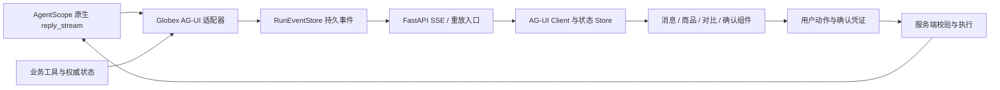

# Globex 前端重设计与 AG-UI 接入方案

日期：2026-09-09。用户新增要求：重新设计前端，重点改善流畅度、呼吸感和商品卡片，明确使用 AG-UI 与前端渲染结合。

本项从原计划的 P1 修补升级为 **P0 产品交付主线**，与交易可靠性、任务 ID 和 Trace 改造协同推进。目前已完成 B/C 首版代码：真实 AG-UI 后端适配、React SDK、商品卡与交互；D 阶段事件重放及交易确认仍待后端可靠性工作包。接入边界见 [首版接入](AG-UI首版接入.md)，本轮验证见 [实施验证记录](AG-UI首版验证记录-2026-09-09.md)。

- [可交互设计预览](previews/globex-agui-preview.html)
- [总实施计划](待实现设计与实施计划-2026-09-09.md)

## 1. 页面与视觉方向

定位：能理解需求、展示可信商品证据、陪用户完成选择的购物助手。

采用暖白底、墨绿色主色、浅鼠尾草绿辅助色和少量暖橙强调。布局以内容和商品图为主，使用宽松留白、清楚的字号层级、克制的边框与阴影。字体与组件在正式工程中统一为设计 token；中文保证可读性，不为造型牺牲小字清晰度。

### 桌面结构

- **轻侧栏**：品牌、新选购、会话历史、收藏；不常驻 buyer_id、session_id 等技术信息。
- **主区域**：首页是可直接输入需求的选购入口；开始对话后以本轮需求、简洁进度、解释和商品结果组成连续内容流。
- **商品结果区**：大图卡片，每行 2–3 张；卡片重点是图片、标题、商品价、关键理由和一个主要操作。
- **右侧抽屉**：商品详情、规格、配送范围和报价明细；需要时才打开。
- **底部输入区**：跟随页面的输入框、快捷追问、生成中停止按钮；不会因逐字输出不断跳动。
- **诊断面板**：工具调用、Trace 和协议事件放进可展开的开发面板。用户默认看到“正在筛选预算”“已找到 3 件”等真实进度。

### 核心组件

| 组件 | 内容与行为 |
|---|---|
| `MessageThread` | 按 messageId 增量更新，支持文本与结构化内容；流式结束不重复追加全文 |
| `RunProgress` | 等待、检索中、报价中、完成、失败、已停止；只使用真实发生的状态，不输出虚假百分比 |
| `ProductGrid` / `ProductCard` | 固定图片比例、主价、两条亮点、来源、收藏、查看详情、加入对比 |
| `ProductDetailDrawer` | 图册、完整说明、规格 chip、库存状态、配送范围和报价入口 |
| `CompareTray` / `ComparisonPanel` | 选择 2–3 件比较价格、容量、材质和其他已知参数；未知值明确为空 |
| `ConstraintChips` | 预算、目的地、品类等可编辑条件；修改后发起新检索或重报价 |
| `QuoteBreakdown` | 商品小计、运费、关税、总额，绑定 SKU/数量/目的地与有效期 |
| `ConfirmationCard` | 展示当前确认快照，确认、修改、放弃；绑定服务端确认凭证 |
| `EmptyState` / `ErrorState` | 无结果说明与可操作的放宽条件；失败可重试，保留输入 |

移动端使用单列或横向商品浏览，详情改为全屏/底部抽屉；输入框考虑安全区与软键盘。导航收起，内容不产生横向页面溢出。

## 2. 流畅度与呼吸感的工程要求

- 建立 8px 基础间距系统；卡片内部约 20–24px，区块间约 32–48px，避免信息挤成一块。
- 骨架屏提前保留图片、文字、价格的空间，数据到达后原位替换，避免布局跳跃。
- 文本流按帧或短时间窗口合并更新；只订阅当前消息的组件重渲染，卡片不跟随每个 token 重建。
- 图片固定宽高比、使用缩略图与懒加载，完整大图在详情中加载；正式交付做 WebP/AVIF 等优化与尺寸预算。
- 微交互以 160–220ms 为起点，区块入场约 240–320ms；只对 transform/opacity 做主要动画。
- “呼吸感”主要来自间距、节奏和稳定布局。只在等待态使用低对比度呼吸光，不让商品、价格或正文持续闪动。
- 自动滚动只在用户接近底部时跟随；用户向上阅读后暂停追随，并提供“查看新回复”。
- 尊重 `prefers-reduced-motion`；键盘焦点可见；按钮触控区域至少 44px；中文输入法组合期间 Enter 不误发送。
- 停止按钮要取消客户端流并向服务端传递取消意图。单独调用客户端 abort 只会断开 HTTP 请求，不能据此声称 worker 已停止。已提交的交易以查询结果收口，不能因为停止动画就宣称回滚。

建议验收目标：390/768/1440px 布局通过；目标测试设备卡片交互响应约 100ms 内；生成过程没有持续长任务或显著布局跳跃。首 token 的模型等待与前端自身处理耗时分开记录，不能用动画掩盖后端延迟。

## 3. AG-UI 的职责与接线

AG-UI 负责 Agent 与页面之间的类型化事件、消息和状态同步。页面样式与卡片由 React 组件实现，不要求为了接协议更换 AgentScope 或套用固定聊天模板。[官方架构](https://docs.ag-ui.com/concepts/architecture)

建议保留 React + Vite，接入 `@ag-ui/core` / `@ag-ui/client`；后端使用 `ag-ui-protocol` 事件模型与 encoder。在 FastAPI 新增 AG-UI 入口，由 `HttpAgent` 使用 POST + SSE 连接。正式实施锁定 Python/TypeScript SDK 版本，做双方 schema 兼容检查。[HttpAgent](https://docs.ag-ui.com/sdk/js/client/http-agent)、[Python Encoder](https://docs.ag-ui.com/sdk/python/encoder/overview)

不要只将旧 `TradeEvent.type` 改名：当前 `orchestrator._consume_reply` 已丢失部分原生 message/block/tool-call ID 与参数增量。适配器应在原生事件仍完整的位置接入；原有业务事件可继续供兼容客户端与审计使用，但不能重复发布同一工具生命周期。

### 事件映射

| 来源 | AG-UI 输出 | 页面处理 |
|---|---|---|
| 接受一次执行 | `RUN_STARTED` | 创建 run 状态；缓存命中也有完整生命周期 |
| 文本开始/增量/结束 | `TEXT_MESSAGE_START/CONTENT/END` | 根据 messageId 局部更新正文 |
| 工具调用开始/参数增量/参数结束 | `TOOL_CALL_START/ARGS/END` | 展示准备、执行中或待确认状态 |
| 工具执行结果 | `TOOL_CALL_RESULT` | 按 toolCallId 归属结果，失败不必终止整个 run |
| 商品、报价、计划、确认状态 | `STATE_SNAPSHOT/STATE_DELTA` | 类型校验后更新相应业务组件 |
| 历史恢复/最终文本校正 | `MESSAGES_SNAPSHOT` | 替换消息快照并按 ID 保持一致 |
| 正常完成 | `RUN_FINISHED` | 结束输入忙碌态，保留已展示结果 |
| 不可恢复执行错误 | `RUN_ERROR` | 提示终态失败并提供恢复入口 |
| 缓存、模型降级、压缩等通知 | `CUSTOM` | 显示必要提示或进入诊断面板 |

`TOOL_CALL_END` 表示调用参数流结束，不能用它表示工具已经成功执行；结果有独立事件和消息 ID。[工具生命周期](https://docs.ag-ui.com/concepts/tools)、[事件类型](https://docs.ag-ui.com/sdk/js/core/events)

状态快照提供完整基线，增量使用 JSON Patch。商品卡从类型化状态读取，不再遍历任意历史 tool.result 找“最近非空 hits”。[状态同步](https://docs.ag-ui.com/concepts/state)

### ID、重放和状态所有权

- `threadId` 对应购物会话，服务端绑定买家；`runId` 标识一次外层执行，并与队列 task_id 显式关联。
- `messageId` 标识展示消息；`toolCallId` 对应实际调用；主/子 Agent 并行调用必须有稳定命名空间。
- 同一网络提交重试使用相同 runId；新意图使用新 runId。确认恢复也按锁定 SDK 的恢复合同新建外层 run，不直接复用 AgentScope reply_id。
- 增加 `RunEventStore`，先落事件再广播，记录 sequence 和业务状态 revision；恢复时提供快照与其后的增量。
- 游标、事件去重与重连接口是 Globex 必须实现的传输约定。现有 Redis Pub/Sub 不负责补发断线期间消息，AG-UI 也不会自动提供存储。
- 前端可以提交比较列表、选中 SKU 或编辑条件；价格、库存、订单与确认状态始终由服务端计算。不能将客户端传入 state 当成权威业务事实。

## 4. 商品、报价和结果的数据契约

已核对 500 条目录：全部没有商品图片/画廊/源链接。评分、描述、尺寸、配送范围等在领域对象里存在，但有些尚未进入商品卡 DTO。当前评分和平台等为合成演示数据，不应包装成真实平台评价。

| 契约 | 必要字段 |
|---|---|
| `ProductView` | productId、canonicalProductId、title、brand、media、skuOptions、source、rating/provenance、highlights、详情字段 |
| `MediaView` | src、alt、width、height、kind=`actual/illustration/placeholder`；缺图有稳定占位 |
| `QuoteView` | quoteId、productId、skuId、quantity、shipTo、currency、分项金额、quotedAt/expiresAt、status |
| `SearchResultView` | runId、searchId、constraints、productIds、filteredOut、revision；允许空结果替换 |
| `PendingConfirmationView` | confirmationId、版本、报价/地址摘要、有效期、当前状态与允许动作 |

商品主价当前是目标币种，SKU 详情保留平台币种；现有到手价只按默认可售 SKU、数量 1 计算。新 UI 切规格/数量/目的地后必须重新报价，报价未返回时显示待确认，不能复用旧总额。

没有 ETA、销量、划线价、店铺政策等来源的字段暂不展示。检索相关度 score 与用户评分严格区分。当前订单是下单意向单，按钮使用“确认下单意向”，不宣称已支付、已发货。

图片建议独立维护 `product-media` 映射，不为设计图改动检索金标。预览已使用内置 imagegen 生成示意图，原图与提示词存放于 [assets](previews/assets/图像生成记录.md)，页面必须明确演示性质。

## 5. 确认卡与人工确认

确认卡进入本次正式交付范围，和总计划第 1 项的权威确认凭证一起实施。

推荐在 AgentScope 原生确认/恢复事件上适配：生成待确认快照，保存 Agent 状态；发出状态与消息快照后结束本次 run，标识等待确认；按钮通过 interruptId 提交同一 thread 的恢复请求。服务端核验归属、快照 hash、有效期与幂等后执行，结果绑定原 toolCallId。[AG-UI Interrupts](https://docs.ag-ui.com/concepts/interrupts)

该流程需以锁定版本能力为准：当前官方文档包含 interrupt/resume 扩展，不能假定所有已发布 SDK 版本都支持全部字段。原生恢复与服务端业务确认只形成一次用户确认流程；不能在点击后再让模型重复询问。自然语言已有效确认时也应绑定同一凭证。

## 6. 实施顺序

| 阶段 | 交付 | 验收 |
|---|---|---|
| A：本轮设计 | 视觉规范、交互预览、AG-UI 映射、数据契约 | 能实际体验卡片、详情、对比、收藏、流式节奏；明确模拟边界 |
| B：P0 联通 | 原生事件 adapter、run/message/tool ID、SSE、React AG-UI client、商品投影 | 真实 Agent 检索→流式解释→商品卡；缓存命中/工具失败正确收口 |
| C：P0 完整体验 | 媒体映射、详情/比较、响应式、空态、停止与错误处理 | 桌面/移动体验一致；商品组件不随 token 整组重绘 |
| D：P0 可靠交互 | 事件重放、快照恢复、确认卡与业务凭证 | 断线不重复消息或下单；确认改价/过期失效；刷新可恢复 |
| E：P1 后续优化 | 历史/收藏持久化、长列表性能、反馈入口、数据与成本观测 | 用体验与运行指标决定后续优化 |

页面 B/C 可与后台幂等和队列改造并行；D 必须依赖后台交易与任务可靠性。不要等所有自进化功能完成才交付前端。

建议文件落位：后端 `app/presentation/ag_ui.py`、`app/application/agents/ag_ui_adapter.py`、事件存储端口及实现；前端 `src/agent/`（client、state、contracts）、`src/components/commerce/`、`src/components/chat/`、`src/styles/tokens.css`。实际首版采用 `src/lib/commerceClient.ts` + `src/hooks/useCommerceAgent.ts`，其余按现有组件目录落位；事件持久化存储仍待 D 阶段。

正式验收覆盖：并行同名工具、空结果、HTTP/流错误、缓存命中、停止、重连、跨 run 结果隔离、选择 SKU 后报价刷新、确认恢复幂等、移动软键盘、减少动态效果模式和键盘访问。

## 7. 前一轮设计预览验证记录

- 单文件脚本语法检查通过，3 张相对路径商品示意图及文档链接均存在。
- 在浏览器检查 1440px 桌面和 390px 手机断点，商品图片与布局正常。
- 实际操作两件商品加入比较及比较弹层、手机详情抽屉、Escape 关闭。
- 输入“预算100元以内的背包”，演示流完成后仅保留 39 元的 BudgetPack。
- 检查停止生成，并修正立即停止时仍显示“正在整理”及“保留已找到商品”的不一致文案。
- 浏览器未捕获脚本错误；预览已打开供查看。

以上仅证明设计预览的布局与本地交互。没有在本轮安装 AG-UI SDK 或接通真实 Agent，也没有验证真实订单、队列恢复或端到端性能指标。
